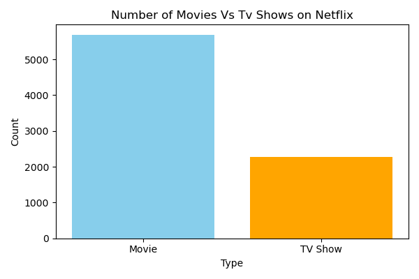
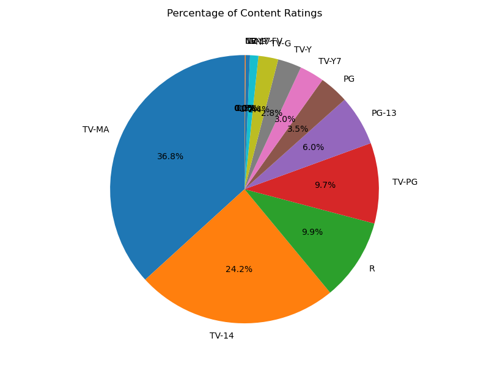
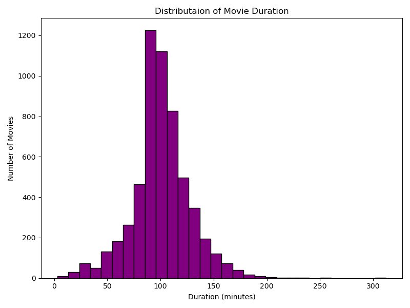
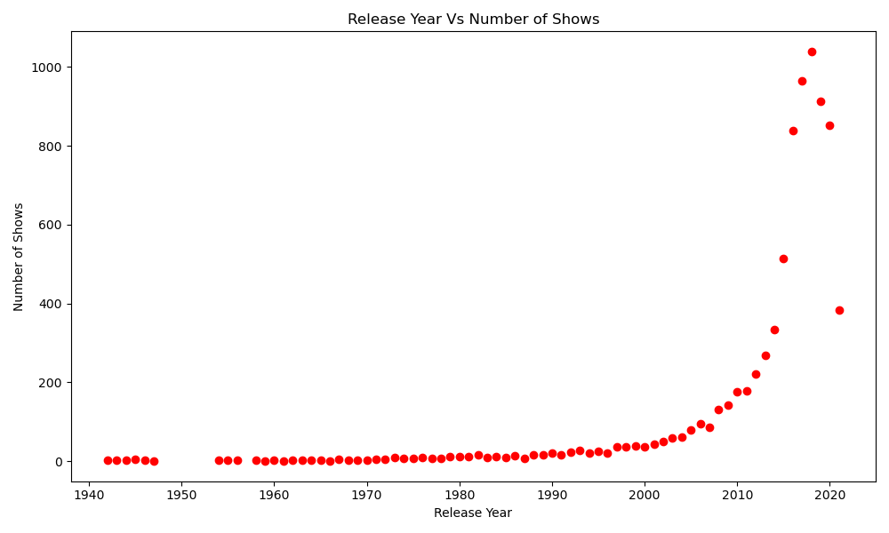
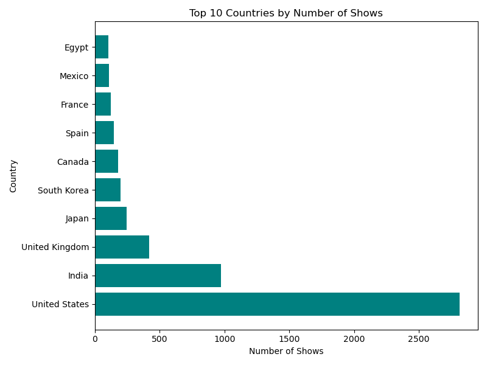
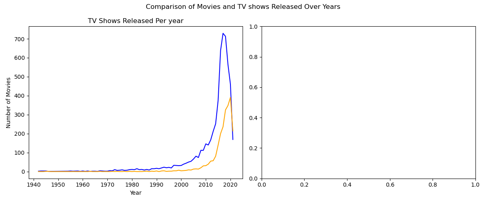

# 📊 Netflix Data Visualization Project

This project performs exploratory data analysis and visualization on Netflix's content dataset using Python. It aims to reveal patterns in content types, release years, countries, ratings, and durations.

---

## 📁 Dataset

- **Source:** [Kaggle - Netflix Shows Dataset](https://www.kaggle.com/datasets/shivamb/netflix-shows)
- **Data Includes:** Title, Type, Country, Date Added, Release Year, Duration, Rating, Genre

---

## 🧰 Tools & Technologies

- Python 🐍
- Pandas
- Matplotlib
- Jupyter Notebook

---

## 📌 Key Visualizations

### 📉 1. Number of Movies vs TV Shows
Bar chart showing how **Movies outnumber TV Shows** on Netflix.



---

### 🧁 2. Percentage of Content Ratings
Pie chart displaying the **percentage share** of each content rating (TV-MA, PG, TV-14, etc.)



---

### ⏱ 3. Distribution of Movie Durations
Histogram showing most movies are around **90–120 minutes** long.



---

### 📆 4. Release Year vs Number of Shows
Scatter plot showing how content added to Netflix increased significantly **after 2015**.



---

### 🌍 5. Top 10 Countries by Number of Shows
Bar chart of countries producing the most content on Netflix. **USA and India** lead the list.



---

### 🔄 6. Comparison of Movies and TV Shows Over the Years
Line chart comparing how movies and shows have evolved year over year.



---

## 🔍 Key Insights

- **TV-MA** and **TV-14** are the most frequent ratings.
- Netflix has more **Movies** than TV Shows.
- The platform’s content library grew massively after **2015**.
- **USA** and **India** are the leading producers of Netflix content.
- Movie durations are mostly between **90–120 minutes**.

---

## ▶️ How to Run

1. **Clone the repository**:
   ```bash
   git clone https://github.com/Jaideep0710/netflix-data-visualisation.git
